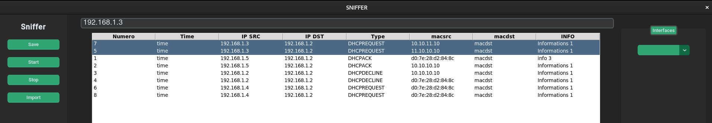

## Test unitaire de la barre de recherche 

Le code tkinter :  

        self.search_entry_var = customtkinter.StringVar()
        self.search_entry = customtkinter.CTkEntry(self, textvariable=self.search_entry_var,font=("Helvetica", 20))
        self.search_entry.grid(row=0, column=1, padx=(0, 0), pady=(10, 0), sticky="nwe")
        self.search_entry.bind("<Return>", self.search)

La fonction associée : 

    def search(self, event):
        search_text = self.search_entry_var.get().lower()
        self.packet_tree.selection_remove(*self.packet_tree.selection())
        for item in self.packet_tree.get_children():
            values = self.packet_tree.item(item)['values']
            if any(isinstance(value, str) and search_text in value.lower() for value in values):
                self.packet_tree.selection_add(item)
                self.packet_tree.move(item, '', '0')
                self.packet_tree.see(item)

La fonction permet de faire remonté les paquets dans le tableau en fonction de la recherche.

### Test dans pour une valeur aléatoire du tableau

Je cherche avec un élement de la colonne 2 (0,1,2): IP SRC 

### Test avec une seconde valeur d'une autre colonne

Je cherche avec un élément de la colonne  5 : MAC SRC

La barre de recherche fonctionne et permet d'afficher les paquets qui nous intéresse.