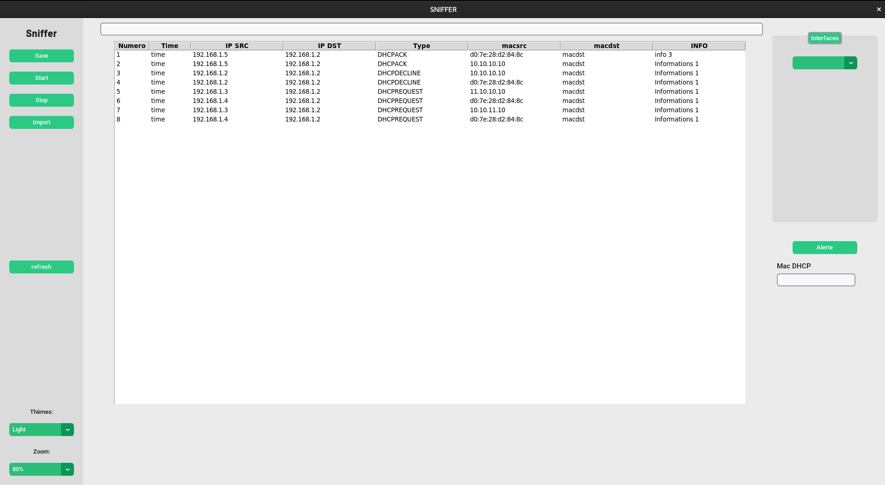
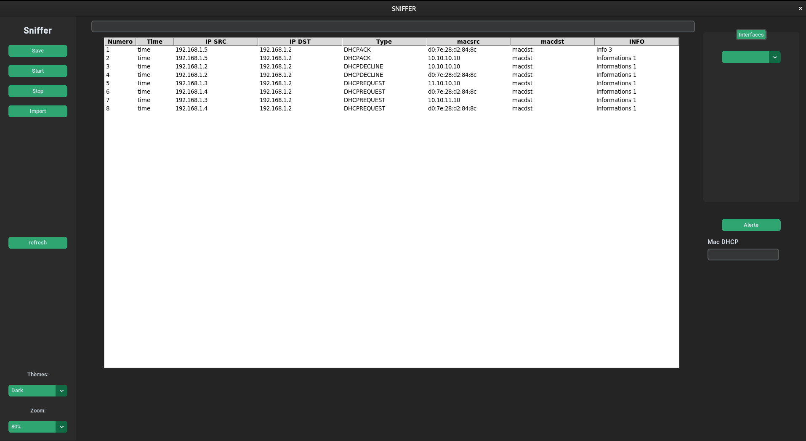

### Test Unitaire des Menus déroulants thèmes et zoom

Le code tkinter : 

        self.appearance_mode_label = customtkinter.CTkLabel(self.sidebar_frame, text="Thèmes:", anchor="w")
        self.appearance_mode_label.grid(row=6, column=0, padx=20, pady=(10, 0))
        self.appearance_mode_optionemenu = customtkinter.CTkOptionMenu(self.sidebar_frame, values=["Light", "Dark"],
                                                                       command=self.change_appearance_mode_event)
        self.appearance_mode_optionemenu.grid(row=7, column=0, padx=20, pady=(10, 10))
        self.scaling_label = customtkinter.CTkLabel(self.sidebar_frame, text="Zoom:", anchor="w")
        self.scaling_label.grid(row=8, column=0, padx=20, pady=(10, 0))
        
        
        # Mise en place d'un menu déroulant avec les différentes interfaces
        self.scaling_optionemenu = customtkinter.CTkOptionMenu(self.sidebar_frame, values=["80%", "90%", "100%", "110%", "120%"],
                                                               command=self.change_scaling_event)
        self.scaling_optionemenu.grid(row=9, column=0, padx=20, pady=(10, 20))

La fonction associée :

    # Changement de l'apparance
    def change_appearance_mode_event(self, new_appearance_mode: str):
        customtkinter.set_appearance_mode(new_appearance_mode)

### Test des fonctionnalitées :  

Thème clair et zoom à 80 %

Thème sombre et zoom à 80 %

Thème sombre et zoom à 90 %

Les fonctionnalitées sont correcte.