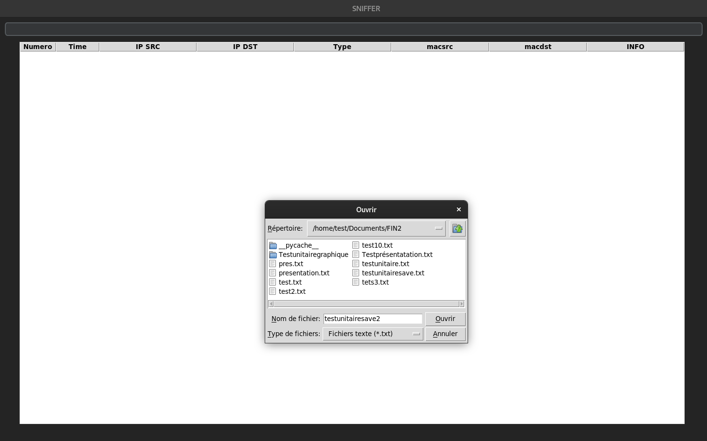

## Test unitaire du bouton save 

Le bout de code dans tkinter 

        self.sidebar_button_1 = customtkinter.CTkButton(self.sidebar_frame,command=self.save_selected_items_to_file, text="Save")#command=self.sauvegarder_contenu_arborescence
        self.sidebar_button_1.grid(row=1, column=0, padx=20, pady=10)

La fonction associée : 

    def save_selected_items_to_file(self):
        
        # Sélectionne tous les éléments de l'arborescence
        items = self.packet_tree.get_children()
        for item in items:
            self.packet_tree.selection_add(item)

        # Récupère les éléments sélectionnés
        selected_items = self.packet_tree.selection()

        # Ouvre la boîte de dialogue pour choisir le fichier
        file_path = filedialog.asksaveasfilename(defaultextension=".txt", filetypes=[("Text files", "*.txt")])

        # Vérifie si l'utilisateur a annulé la boîte de dialogue
        if not file_path:
            return

        # Écrit les éléments sélectionnés dans le fichier
        with open(file_path, 'w') as file:
            for item in selected_items:
                values = self.packet_tree.item(item, 'values')
                line = ', '.join(map(str, values))
                file.write(f"{line}\n")

Sauvegarder les données du tableau et les ajoutes dans un fichier sous cette forme.

        1, time, 192.168.1.5, 192.168.1.2, DHCPACK, d0:7e:28:d2:84:8c, macdst, info 3
        2, time, 192.168.1.5, 192.168.1.2, DHCPACK, 10.10.10.10, macdst, Informations 1
        3, time, 192.168.1.2, 192.168.1.2, DHCPDECLINE, 10.10.10.10, macdst, Informations 1
        4, time, 192.168.1.2, 192.168.1.2, DHCPDECLINE, d0:7e:28:d2:84:8c, macdst, Informations 1
        5, time, 192.168.1.3, 192.168.1.2, DHCPREQUEST, 11.10.10.10, macdst, Informations 1
        6, time, 192.168.1.4, 192.168.1.2, DHCPREQUEST, d0:7e:28:d2:84:8c, macdst, Informations 1
        7, time, 192.168.1.3, 192.168.1.2, DHCPREQUEST, 10.10.11.10, macdst, Informations 1
        8, time, 192.168.1.4, 192.168.1.2, DHCPREQUEST, d0:7e:28:d2:84:8c, macdst, Informations 1

### Test de la fonctionnalité avec un tableau non vide : 

Le paquet importé est bien dans un fichier txt sous cette forme.

        46, time, 192.168.1.5, 192.168.1.2, DHCPACK, d0:7e:28:d2:84:8c, macdst, info 3
        47, time, 192.168.1.5, 192.168.1.2, DHCPACK, 10.10.10.10, macdst, Informations 1
        48, time, 192.168.1.2, 192.168.1.2, DHCPDECLINE, 10.10.10.10, macdst, Informations 1
        49, time, 192.168.1.2, 192.168.1.2, DHCPDECLINE, d0:7e:28:d2:84:8c, macdst, Informations 1
        50, time, 192.168.1.3, 192.168.1.2, DHCPREQUEST, 11.10.10.10, macdst, Informations 1
        51, time, 192.168.1.4, 192.168.1.2, DHCPREQUEST, d0:7e:28:d2:84:8c, macdst, Informations 1
        52, time, 192.168.1.3, 192.168.1.2, DHCPREQUEST, 10.10.11.10, macdst, Informations 1
        53, time, 192.168.1.4, 192.168.1.2, DHCPREQUEST, d0:7e:28:d2:84:8c, macdst, Informations 1

### Test de la fonctionnalité avec un tableau : 

Aucun fichier créée. 

Fonctionnement de la fonction est correspond au attente.

