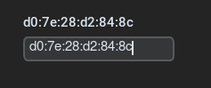

## Test unitaire de la mise en place de l'adresse mac 

Le code tkinter :

Un titre qui est changé l'orsque on valide l'entré dans une entrée.

        self.search_entry1 = customtkinter.CTkEntry(self, width=170, font=("Helvetica", 15))
        self.search_entry1.grid(row=1, column=2, padx=(30, 0), pady=(110, 0), sticky="nw")
        self.search_entry1.bind("<Return>", self.search1)
        
        self.alerte_label1 = customtkinter.CTkLabel(self, text="Mac DHCP", font=customtkinter.CTkFont(size=15))
        self.alerte_label1.grid(row=1, column=2, padx=(30,0), pady=(80, 0), sticky="nw")

La fonction associée :

    def search1(self, event):
    # Récupérer la valeur de l'Entry
        search_text = self.search_entry1.get()
        self.alerte_label1.configure(text=search_text)
        compteur = 0
        liste_id = []
        
        # Parcourir les éléments du Treeview
        for item in self.packet_tree.get_children():
            # Récupérer la valeur de la colonne 'Type' pour cet élément
            packet_type = self.packet_tree.item(item, 'values')[4]  # La colonne 'Type' est indexée à 4

            # Vérifier si le type est 'Offer', 'Decline', 'Ack' ou 'NAK'
            if packet_type in ['DHCPOFFER', 'DHCPDECLINE', 'DHCPACK', 'DHCPNACK']:
                # Récupérer la valeur de la colonne 'macsrc' pour cet élément
                macsrc_value = self.packet_tree.item(item, 'values')[5]  # La colonne 'macsrc' est indexée à 5

                # Vérifier si la valeur de 'macsrc' correspond à la recherche
                if search_text == macsrc_value:
                    # Sélectionner cet élément dans le Treeview
                    pass  # Sortir de la boucle dès que la valeur est trouvée
                else:
                    compteur += 1
                    id = self.packet_tree.item(item, 'values')[0]
                    liste_id.append(id)
                               
            else:
                # Si la boucle s'exécute sans interruption (c'est-à-dire que la valeur n'a pas été trouvée)
                print("Aucun paquet de type Offer, Decline, Ack ou NAK avec la valeur macsrc correspondante n'a été trouvé.")
        
        if compteur > 0:
            messagebox.showinfo( "Alerte !", "Suspicion d'une usurpation de l'adresse MAC du DHCP sur les paquets "+str(liste_id))

La fonction permet de vérifier dans les paquets offer, decline, ack ou nack si l'adresse du serveur dhcp présente dans les paquets correspond bien à l'adresse fournit par l'utilisateur.

### Test de la mise en dur de l'adresse MAC du DHCP

Puis on appuie sur entrée 

La fonction marche et change le nom du titre. 

Dans le terminal on remarque que la seconde partie de la fonction marche.

Une information est affiché quand il n'y a pas d'adresse Mac car aucun des infos du tableau de match.