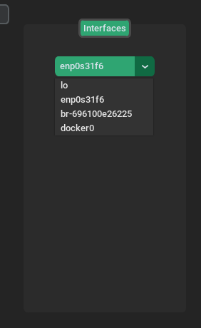
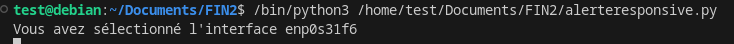
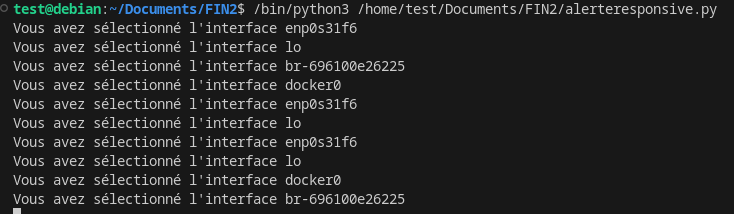

### Test Unitaire du Menu déroulant des interfaces réseau

Utilisation de la librairie psutil

Récupération de la liste des interfaces : 

        interfacelist = [interface for interface in psutil.net_if_addrs().keys()]

Le code tkinter : 

        self.tabview = customtkinter.CTkTabview(self, width=180)
        self.tabview.grid(row=0, column=2, padx=(20, 20), pady=(20, 0), sticky="nsew")
        self.tabview.add("Interfaces")
        self.tabview.tab("Interfaces").grid_columnconfigure(0, weight=3)  # configure grid of individual tabs
        self.selected_interface = customtkinter.StringVar()
        # Mise en place d'un menu déroulant avec les différentes interfaces
        self.optionmenu_1 = customtkinter.CTkOptionMenu(self.tabview.tab("Interfaces"), dynamic_resizing=True,values=interfacelist,variable=self.selected_interface)
        self.optionmenu_1.grid(row=0, column=0, padx=20, pady=(20, 10))
        self.selected_interface.trace_add('write', self.interface_changed)

La fonction associée : 

    def interface_changed(self, *args):
        # Cette fonction sera appelée à chaque fois que la valeur de la variable change
            self.selected_value = self.selected_interface.get()
            print("Vous avez sélectionné l'interface", self.selected_value)

### Test de la fonctionnalité : 
Sélection d'une interface aléatoire : 

Vérification dans le terminal : 

La fonciton est correcte.

### Second test : 
Sélection de plusieur interface aléatoire : 

La fonctionnalité est correcte.

