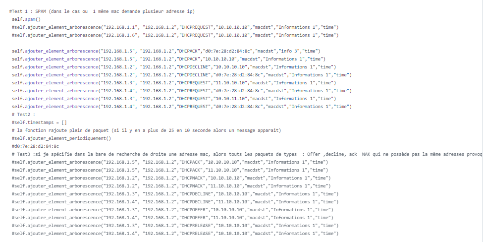

# Dans cette section vous trouverez les informations relatives au alertes de l'application.

- Elle permet d'avoir une vision d'ensemble d'un serveur avec une supervision de la palge du DHCP,pourcentage d'adresse disponible.
    - Script graph2.py 

- Elle permet d'alerter une potentielle attaque par deni de service, plus de 25 paquets en 10 secondes génére une alerte.

- Elle permet de détecter les demandes d'adresses répétées en fonction de l'adresse mac de l'utilisateur.

- Elle permet de détecter un second DHCP dans le réseau. 

Ces fonctionnalités n'ont pas toute étais testé en temps réelle , voici un bout de code commenter dans l'application qui permet de vérifier leur fonctionnement :

Le code est commenté pour les dévellopeurs pour leur permettre de comprendre le fonctionnement de chaque lignes.