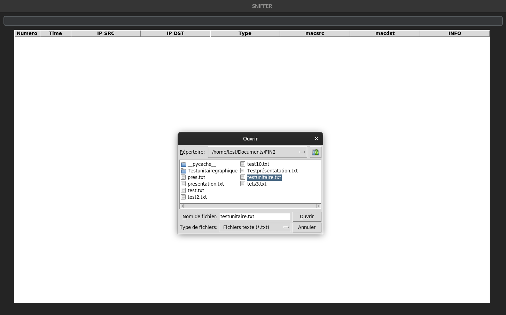
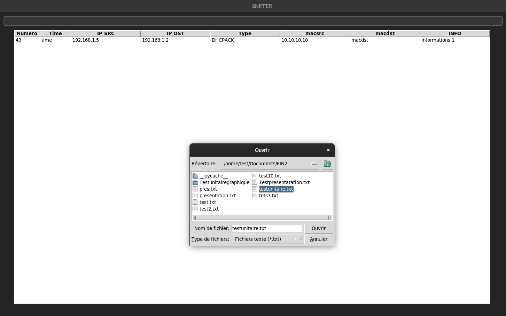
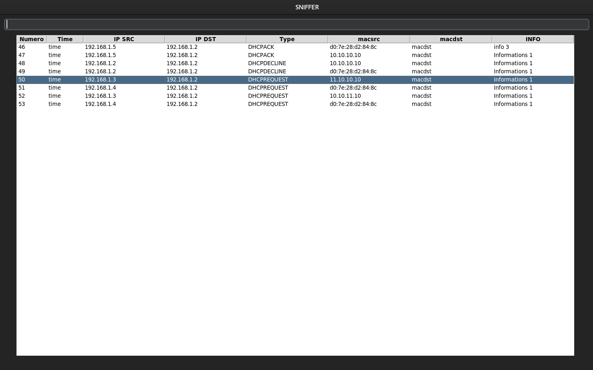

## Test Unitaire du bouton import 

Le bouton dans le code tkinter 

        self.sidebar_button_4 = customtkinter.CTkButton(self.sidebar_frame, command=self.button_fonction, text='Import')
        self.sidebar_button_4.grid(row=4, column=0, padx=20, pady=10)

La fonction associée :

    def button_fonction(self):
        fichier = filedialog.askopenfilename(filetypes=[("Fichiers texte", "*.txt"), ("Tous les fichiers", "*.*")])
        if fichier:
            self.clear_treeview()
            with open(fichier, 'r', encoding='utf-8') as file:
                contenu = file.read()
            self.modifier_et_afficher(contenu)       

Importe un fichier avec les données en nétoyant le tableau.

### Test de la fonctionnalité dans un arbre vide  : 
Importation du fichier testunitaire.txt dans le dossier document

Résultat :  

Fonctionnement correct.

###  Test de la fonctionnalité avec un arbre non vide  :
Importation du fichier testunitaire.txt dans le dossier document

Resultat : 

Fonctionnement correct.
 
Si on possède des entrées différentes d'un fichier .txt sous cette forme :  

        1, time, 192.168.1.5, 192.168.1.2, DHCPACK, d0:7e:28:d2:84:8c, macdst, info 3
        2, time, 192.168.1.5, 192.168.1.2, DHCPACK, 10.10.10.10, macdst, Informations 1
        3, time, 192.168.1.2, 192.168.1.2, DHCPDECLINE, 10.10.10.10, macdst, Informations 1
        4, time, 192.168.1.2, 192.168.1.2, DHCPDECLINE, d0:7e:28:d2:84:8c, macdst, Informations 1
        5, time, 192.168.1.3, 192.168.1.2, DHCPREQUEST, 11.10.10.10, macdst, Informations 1
        6, time, 192.168.1.4, 192.168.1.2, DHCPREQUEST, d0:7e:28:d2:84:8c, macdst, Informations 1
        7, time, 192.168.1.3, 192.168.1.2, DHCPREQUEST, 10.10.11.10, macdst, Informations 1
        8, time, 192.168.1.4, 192.168.1.2, DHCPREQUEST, d0:7e:28:d2:84:8c, macdst, Informations 1

Le programme plante, car il n'est pas possible de rajouter n'importe quoi dans le tableau.
