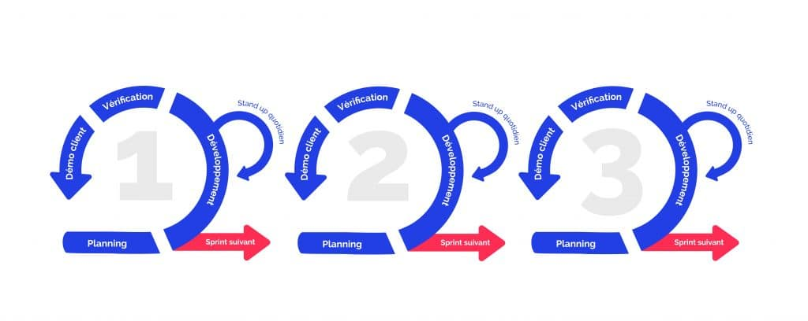

# Gestion de projet  : 

Méthodologie de la gestion de projet  : 

### Méthode Agile : 

 

Equipe de dev  : **Issam Hamidi, Moad Razzaki et Alexis Brunel** 

### Sprint planning 
Quantification du travail par dévellopeur 
 
*Durée : 1 heure*

### Sprint review 
Avancement du projet, vérification des sprints 
 
*Durée :  1 heure*

### Daily meeting : 
Répartition des tâches pour une durée de 24 heures. Réalisé tous les matins (période en cours)
 
*Durée : 15 minutes* 

### Etat de tâches : 
- Backlog 
- En cours
- Clotûré

Backlog : En attente de prise en charge 
 
En cours: Pris en charge par un développeur
 
Clôturé : Terminé et fonctionnel

Organisation des tâches princiapale sous forme de lot avec réunion go/nogo 
