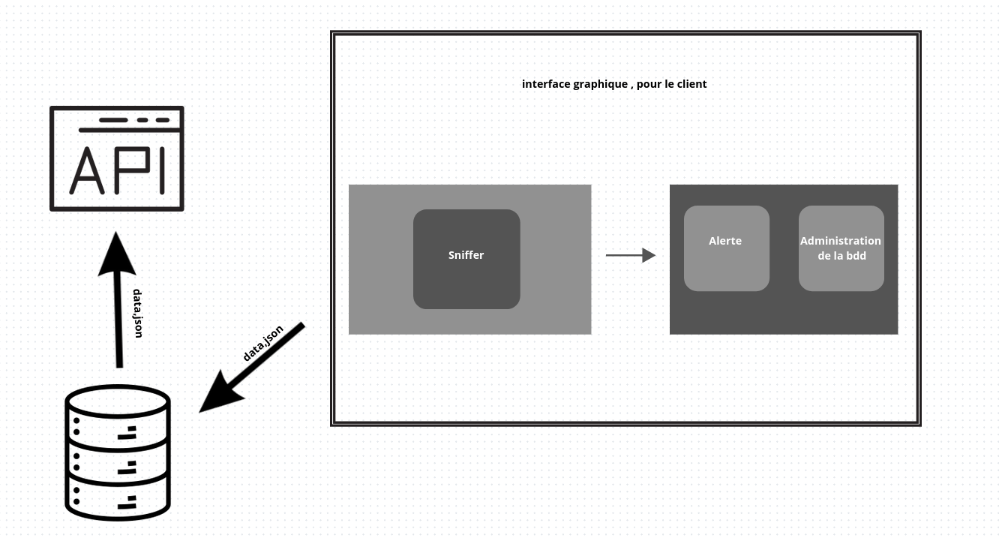
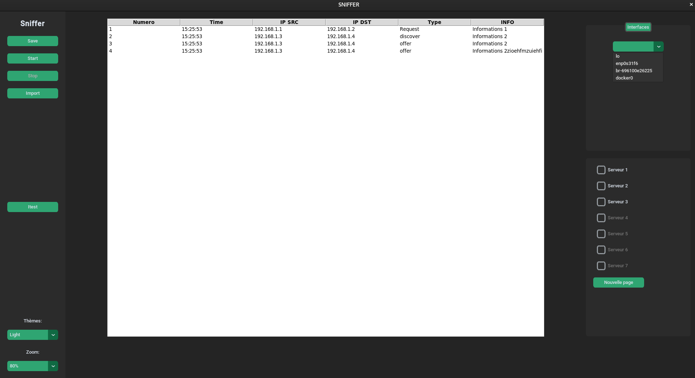
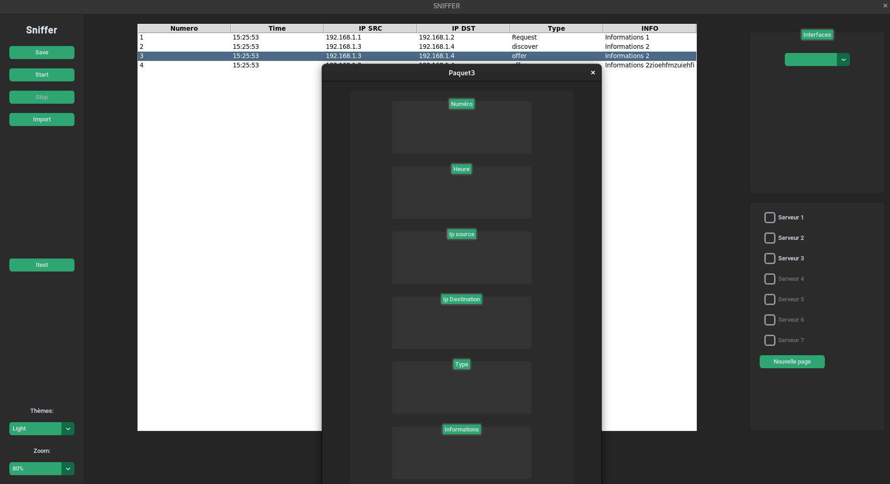

# Voici l'architecture de notre application

Interface graphique

# Exemple d'infomartion suplémentaire

## Exemple de sauvegarde 

## Exemple de paquet récupéré avec le sniffer

root@debian:/home/test# /bin/python3 /home/test/test2.py
{'Type': 'DHCPRELEASE', 'Ethernet': {'dst': 'd0:7e:28:2d:84:8c', 'src': 'b0:7b:25:26:a1:19', 'type': 2048}, 'IP': {'version': 4, 'ihl': 5, 'tos': 0, 'len': 328, 'id': 4894, 'flags': <Flag 2 (DF)>, 'frag': 0, 'ttl': 64, 'proto': 17, 'chksum': 3515, 'src': '10.203.4.1', 'dst': '10.255.255.1', 'options': []}, 'UDP': {'sport': 68, 'dport': 67, 'len': 308, 'chksum': 6674}, 'BOOTP': {'op': 1, 'htype': 1, 'hlen': 6, 'hops': 0, 'xid': 1652885542, 'secs': 0, 'flags': <Flag 0 ()>, 'ciaddr': '10.203.4.1', 'yiaddr': '0.0.0.0', 'siaddr': '0.0.0.0', 'giaddr': '0.0.0.0', 'chaddr': b'\xb0{%&\xa1\x19\x00\x00\x00\x00\x00\x00\x00\x00\x00\x00', 'sname': b'\x00\x00\x00\x00\x00\x00\x00\x00\x00\x00\x00\x00\x00\x00\x00\x00\x00\x00\x00\x00\x00\x00\x00\x00\x00\x00\x00\x00\x00\x00\x00\x00\x00\x00\x00\x00\x00\x00\x00\x00\x00\x00\x00\x00\x00\x00\x00\x00\x00\x00\x00\x00\x00\x00\x00\x00\x00\x00\x00\x00\x00\x00\x00\x00', 'file': b'\x00\x00\x00\x00\x00\x00\x00\x00\x00\x00\x00\x00\x00\x00\x00\x00\x00\x00\x00\x00\x00\x00\x00\x00\x00\x00\x00\x00\x00\x00\x00\x00\x00\x00\x00\x00\x00\x00\x00\x00\x00\x00\x00\x00\x00\x00\x00\x00\x00\x00\x00\x00\x00\x00\x00\x00\x00\x00\x00\x00\x00\x00\x00\x00\x00\x00\x00\x00\x00\x00\x00\x00\x00\x00\x00\x00\x00\x00\x00\x00\x00\x00\x00\x00\x00\x00\x00\x00\x00\x00\x00\x00\x00\x00\x00\x00\x00\x00\x00\x00\x00\x00\x00\x00\x00\x00\x00\x00\x00\x00\x00\x00\x00\x00\x00\x00\x00\x00\x00\x00\x00\x00\x00\x00\x00\x00\x00\x00', 'options': b'c\x82Sc'}, 'DHCP options': {'options': [('message-type', 7), ('server_id', '10.255.255.1'), ('hostname', b'debian'), 'end', 'pad', 'pad', 'pad', 'pad', 'pad', 'pad', 'pad', 'pad', 'pad', 'pad', 'pad', 'pad', 'pad', 'pad', 'pad', 'pad', 'pad', 'pad', 'pad', 'pad', 'pad', 'pad', 'pad', 'pad', 'pad', 'pad', 'pad', 'pad', 'pad', 'pad', 'pad', 'pad', 'pad', 'pad', 'pad', 'pad', 'pad', 'pad', 'pad', 'pad', 'pad', 'pad']}}
{'Type': 'DHCPDISCOVER', 'Ethernet': {'dst': 'ff:ff:ff:ff:ff:ff', 'src': 'b0:7b:25:26:a1:19', 'type': 2048}, 'IP': {'version': 4, 'ihl': 5, 'tos': 16, 'len': 328, 'id': 0, 'flags': <Flag 0 ()>, 'frag': 0, 'ttl': 128, 'proto': 17, 'chksum': 14742, 'src': '0.0.0.0', 'dst': '255.255.255.255', 'options': []}, 'UDP': {'sport': 68, 'dport': 67, 'len': 308, 'chksum': 57173}, 'BOOTP': {'op': 1, 'htype': 1, 'hlen': 6, 'hops': 0, 'xid': 722636365, 'secs': 0, 'flags': <Flag 0 ()>, 'ciaddr': '0.0.0.0', 'yiaddr': '0.0.0.0', 'siaddr': '0.0.0.0', 'giaddr': '0.0.0.0', 'chaddr': b'\xb0{%&\xa1\x19\x00\x00\x00\x00\x00\x00\x00\x00\x00\x00', 'sname': b'\x00\x00\x00\x00\x00\x00\x00\x00\x00\x00\x00\x00\x00\x00\x00\x00\x00\x00\x00\x00\x00\x00\x00\x00\x00\x00\x00\x00\x00\x00\x00\x00\x00\x00\x00\x00\x00\x00\x00\x00\x00\x00\x00\x00\x00\x00\x00\x00\x00\x00\x00\x00\x00\x00\x00\x00\x00\x00\x00\x00\x00\x00\x00\x00', 'file': b'\x00\x00\x00\x00\x00\x00\x00\x00\x00\x00\x00\x00\x00\x00\x00\x00\x00\x00\x00\x00\x00\x00\x00\x00\x00\x00\x00\x00\x00\x00\x00\x00\x00\x00\x00\x00\x00\x00\x00\x00\x00\x00\x00\x00\x00\x00\x00\x00\x00\x00\x00\x00\x00\x00\x00\x00\x00\x00\x00\x00\x00\x00\x00\x00\x00\x00\x00\x00\x00\x00\x00\x00\x00\x00\x00\x00\x00\x00\x00\x00\x00\x00\x00\x00\x00\x00\x00\x00\x00\x00\x00\x00\x00\x00\x00\x00\x00\x00\x00\x00\x00\x00\x00\x00\x00\x00\x00\x00\x00\x00\x00\x00\x00\x00\x00\x00\x00\x00\x00\x00\x00\x00\x00\x00\x00\x00\x00\x00', 'options': b'c\x82Sc'}, 'DHCP options': {'options': [('message-type', 1), ('requested_addr', '10.203.4.1'), ('hostname', b'debian'), ('param_req_list', [1, 28, 2, 3, 15, 6, 119, 12, 44, 47, 26, 121, 42]), 'end', 'pad', 'pad', 'pad', 'pad', 'pad', 'pad', 'pad', 'pad', 'pad', 'pad', 'pad', 'pad', 'pad', 'pad', 'pad', 'pad', 'pad', 'pad', 'pad', 'pad', 'pad', 'pad', 'pad', 'pad', 'pad', 'pad', 'pad']}}
{'Type': 'DHCPOFFER', 'Ethernet': {'dst': 'b0:7b:25:26:a1:19', 'src': 'd0:7e:28:2d:84:8c', 'type': 2048}, 'IP': {'version': 4, 'ihl': 5, 'tos': 224, 'len': 328, 'id': 55761, 'flags': <Flag 0 ()>, 'frag': 0, 'ttl': 255, 'proto': 17, 'chksum': 50781, 'src': '10.203.255.254', 'dst': '10.203.4.1', 'options': []}, 'UDP': {'sport': 67, 'dport': 68, 'len': 308, 'chksum': 19426}, 'BOOTP': {'op': 2, 'htype': 1, 'hlen': 6, 'hops': 1, 'xid': 722636365, 'secs': 0, 'flags': <Flag 0 ()>, 'ciaddr': '0.0.0.0', 'yiaddr': '10.203.4.1', 'siaddr': '10.255.255.2', 'giaddr': '10.203.255.254', 'chaddr': b'\xb0{%&\xa1\x19\x00\x00\x00\x00\x00\x00\x00\x00\x00\x00', 'sname': b'\x00\x00\x00\x00\x00\x00\x00\x00\x00\x00\x00\x00\x00\x00\x00\x00\x00\x00\x00\x00\x00\x00\x00\x00\x00\x00\x00\x00\x00\x00\x00\x00\x00\x00\x00\x00\x00\x00\x00\x00\x00\x00\x00\x00\x00\x00\x00\x00\x00\x00\x00\x00\x00\x00\x00\x00\x00\x00\x00\x00\x00\x00\x00\x00', 'file': b'gpxelinux.0\x00\x00\x00\x00\x00\x00\x00\x00\x00\x00\x00\x00\x00\x00\x00\x00\x00\x00\x00\x00\x00\x00\x00\x00\x00\x00\x00\x00\x00\x00\x00\x00\x00\x00\x00\x00\x00\x00\x00\x00\x00\x00\x00\x00\x00\x00\x00\x00\x00\x00\x00\x00\x00\x00\x00\x00\x00\x00\x00\x00\x00\x00\x00\x00\x00\x00\x00\x00\x00\x00\x00\x00\x00\x00\x00\x00\x00\x00\x00\x00\x00\x00\x00\x00\x00\x00\x00\x00\x00\x00\x00\x00\x00\x00\x00\x00\x00\x00\x00\x00\x00\x00\x00\x00\x00\x00\x00\x00\x00\x00\x00\x00\x00\x00\x00\x00\x00', 'options': b'c\x82Sc'}, 'DHCP options': {'options': [('message-type', 2), ('server_id', '10.255.255.1'), ('lease_time', 60000), ('subnet_mask', '255.255.0.0'), ('router', '10.203.255.254'), ('domain', b'iutbeziers.fr'), ('name_server', '10.255.255.200'), 'end', 'pad', 'pad', 'pad', 'pad', 'pad', 'pad', 'pad', 'pad', 'pad', 'pad', 'pad']}}
{'Type': 'DHCPREQUEST', 'Ethernet': {'dst': 'ff:ff:ff:ff:ff:ff', 'src': 'b0:7b:25:26:a1:19', 'type': 2048}, 'IP': {'version': 4, 'ihl': 5, 'tos': 16, 'len': 328, 'id': 0, 'flags': <Flag 0 ()>, 'frag': 0, 'ttl': 128, 'proto': 17, 'chksum': 14742, 'src': '0.0.0.0', 'dst': '255.255.255.255', 'options': []}, 'UDP': {'sport': 68, 'dport': 67, 'len': 308, 'chksum': 55317}, 'BOOTP': {'op': 1, 'htype': 1, 'hlen': 6, 'hops': 0, 'xid': 722636365, 'secs': 0, 'flags': <Flag 0 ()>, 'ciaddr': '0.0.0.0', 'yiaddr': '0.0.0.0', 'siaddr': '0.0.0.0', 'giaddr': '0.0.0.0', 'chaddr': b'\xb0{%&\xa1\x19\x00\x00\x00\x00\x00\x00\x00\x00\x00\x00', 'sname': b'\x00\x00\x00\x00\x00\x00\x00\x00\x00\x00\x00\x00\x00\x00\x00\x00\x00\x00\x00\x00\x00\x00\x00\x00\x00\x00\x00\x00\x00\x00\x00\x00\x00\x00\x00\x00\x00\x00\x00\x00\x00\x00\x00\x00\x00\x00\x00\x00\x00\x00\x00\x00\x00\x00\x00\x00\x00\x00\x00\x00\x00\x00\x00\x00', 'file': b'\x00\x00\x00\x00\x00\x00\x00\x00\x00\x00\x00\x00\x00\x00\x00\x00\x00\x00\x00\x00\x00\x00\x00\x00\x00\x00\x00\x00\x00\x00\x00\x00\x00\x00\x00\x00\x00\x00\x00\x00\x00\x00\x00\x00\x00\x00\x00\x00\x00\x00\x00\x00\x00\x00\x00\x00\x00\x00\x00\x00\x00\x00\x00\x00\x00\x00\x00\x00\x00\x00\x00\x00\x00\x00\x00\x00\x00\x00\x00\x00\x00\x00\x00\x00\x00\x00\x00\x00\x00\x00\x00\x00\x00\x00\x00\x00\x00\x00\x00\x00\x00\x00\x00\x00\x00\x00\x00\x00\x00\x00\x00\x00\x00\x00\x00\x00\x00\x00\x00\x00\x00\x00\x00\x00\x00\x00\x00\x00', 'options': b'c\x82Sc'}, 'DHCP options': {'options': [('message-type', 3), ('server_id', '10.255.255.1'), ('requested_addr', '10.203.4.1'), ('hostname', b'debian'), ('param_req_list', [1, 28, 2, 3, 15, 6, 119, 12, 44, 47, 26, 121, 42]), 'end', 'pad', 'pad', 'pad', 'pad', 'pad', 'pad', 'pad', 'pad', 'pad', 'pad', 'pad', 'pad', 'pad', 'pad', 'pad', 'pad', 'pad', 'pad', 'pad', 'pad', 'pad']}}
{'Type': 'DHCPACK', 'Ethernet': {'dst': 'b0:7b:25:26:a1:19', 'src': 'd0:7e:28:2d:84:8c', 'type': 2048}, 'IP': {'version': 4, 'ihl': 5, 'tos': 224, 'len': 328, 'id': 55763, 'flags': <Flag 0 ()>, 'frag': 0, 'ttl': 255, 'proto': 17, 'chksum': 50779, 'src': '10.203.255.254', 'dst': '10.203.4.1', 'options': []}, 'UDP': {'sport': 67, 'dport': 68, 'len': 308, 'chksum': 18658}, 'BOOTP': {'op': 2, 'htype': 1, 'hlen': 6, 'hops': 1, 'xid': 722636365, 'secs': 0, 'flags': <Flag 0 ()>, 'ciaddr': '0.0.0.0', 'yiaddr': '10.203.4.1', 'siaddr': '10.255.255.2', 'giaddr': '10.203.255.254', 'chaddr': b'\xb0{%&\xa1\x19\x00\x00\x00\x00\x00\x00\x00\x00\x00\x00', 'sname': b'\x00\x00\x00\x00\x00\x00\x00\x00\x00\x00\x00\x00\x00\x00\x00\x00\x00\x00\x00\x00\x00\x00\x00\x00\x00\x00\x00\x00\x00\x00\x00\x00\x00\x00\x00\x00\x00\x00\x00\x00\x00\x00\x00\x00\x00\x00\x00\x00\x00\x00\x00\x00\x00\x00\x00\x00\x00\x00\x00\x00\x00\x00\x00\x00', 'file': b'gpxelinux.0\x00\x00\x00\x00\x00\x00\x00\x00\x00\x00\x00\x00\x00\x00\x00\x00\x00\x00\x00\x00\x00\x00\x00\x00\x00\x00\x00\x00\x00\x00\x00\x00\x00\x00\x00\x00\x00\x00\x00\x00\x00\x00\x00\x00\x00\x00\x00\x00\x00\x00\x00\x00\x00\x00\x00\x00\x00\x00\x00\x00\x00\x00\x00\x00\x00\x00\x00\x00\x00\x00\x00\x00\x00\x00\x00\x00\x00\x00\x00\x00\x00\x00\x00\x00\x00\x00\x00\x00\x00\x00\x00\x00\x00\x00\x00\x00\x00\x00\x00\x00\x00\x00\x00\x00\x00\x00\x00\x00\x00\x00\x00\x00\x00\x00\x00\x00\x00', 'options': b'c\x82Sc'}, 'DHCP options': {'options': [('message-type', 5), ('server_id', '10.255.255.1'), ('lease_time', 60000), ('subnet_mask', '255.255.0.0'), ('router', '10.203.255.254'), ('domain', b'iutbeziers.fr'), ('name_server', '10.255.255.200'), 'end', 'pad', 'pad', 'pad', 'pad', 'pad', 'pad', 'pad', 'pad', 'pad', 'pad', 'pad']}}
{'Type': 'DHCPDISCOVER', 'Ethernet': {'dst': 'ff:ff:ff:ff:ff:ff', 'src': 'b0:7b:25:26:a1:f7', 'type': 2048}, 'IP': {'version': 4, 'ihl': 5, 'tos': 16, 'len': 328, 'id': 0, 'flags': <Flag 0 ()>, 'frag': 0, 'ttl': 128, 'proto': 17, 'chksum': 14742, 'src': '0.0.0.0', 'dst': '255.255.255.255', 'options': []}, 'UDP': {'sport': 68, 'dport': 67, 'len': 308, 'chksum': 6258}, 'BOOTP': {'op': 1, 'htype': 1, 'hlen': 6, 'hops': 0, 'xid': 149520222, 'secs': 0, 'flags': <Flag 0 ()>, 'ciaddr': '0.0.0.0', 'yiaddr': '0.0.0.0', 'siaddr': '0.0.0.0', 'giaddr': '0.0.0.0', 'chaddr': b'\xb0{%&\xa1\xf7\x00\x00\x00\x00\x00\x00\x00\x00\x00\x00', 'sname': b'\x00\x00\x00\x00\x00\x00\x00\x00\x00\x00\x00\x00\x00\x00\x00\x00\x00\x00\x00\x00\x00\x00\x00\x00\x00\x00\x00\x00\x00\x00\x00\x00\x00\x00\x00\x00\x00\x00\x00\x00\x00\x00\x00\x00\x00\x00\x00\x00\x00\x00\x00\x00\x00\x00\x00\x00\x00\x00\x00\x00\x00\x00\x00\x00', 'file': b'\x00\x00\x00\x00\x00\x00\x00\x00\x00\x00\x00\x00\x00\x00\x00\x00\x00\x00\x00\x00\x00\x00\x00\x00\x00\x00\x00\x00\x00\x00\x00\x00\x00\x00\x00\x00\x00\x00\x00\x00\x00\x00\x00\x00\x00\x00\x00\x00\x00\x00\x00\x00\x00\x00\x00\x00\x00\x00\x00\x00\x00\x00\x00\x00\x00\x00\x00\x00\x00\x00\x00\x00\x00\x00\x00\x00\x00\x00\x00\x00\x00\x00\x00\x00\x00\x00\x00\x00\x00\x00\x00\x00\x00\x00\x00\x00\x00\x00\x00\x00\x00\x00\x00\x00\x00\x00\x00\x00\x00\x00\x00\x00\x00\x00\x00\x00\x00\x00\x00\x00\x00\x00\x00\x00\x00\x00\x00\x00', 'options': b'c\x82Sc'}, 'DHCP options': {'options': [('message-type', 1), ('requested_addr', '10.203.0.141'), ('hostname', b'203-0'), ('param_req_list', [1, 28, 2, 3, 15, 6, 119, 12, 44, 47, 26, 121, 42]), 'end', 'pad', 'pad', 'pad', 'pad', 'pad', 'pad', 'pad', 'pad', 'pad', 'pad', 'pad', 'pad', 'pad', 'pad', 'pad', 'pad', 'pad', 'pad', 'pad', 'pad', 'pad', 'pad', 'pad', 'pad', 'pad', 'pad', 'pad', 'pad']}}
{'Type': 'DHCPREQUEST', 'Ethernet': {'dst': 'ff:ff:ff:ff:ff:ff', 'src': 'b0:7b:25:26:a1:f7', 'type': 2048}, 'IP': {'version': 4, 'ihl': 5, 'tos': 16, 'len': 328, 'id': 0, 'flags': <Flag 0 ()>, 'frag': 0, 'ttl': 128, 'proto': 17, 'chksum': 14742, 'src': '0.0.0.0', 'dst': '255.255.255.255', 'options': []}, 'UDP': {'sport': 68, 'dport': 67, 'len': 308, 'chksum': 4402}, 'BOOTP': {'op': 1, 'htype': 1, 'hlen': 6, 'hops': 0, 'xid': 149520222, 'secs': 0, 'flags': <Flag 0 ()>, 'ciaddr': '0.0.0.0', 'yiaddr': '0.0.0.0', 'siaddr': '0.0.0.0', 'giaddr': '0.0.0.0', 'chaddr': b'\xb0{%&\xa1\xf7\x00\x00\x00\x00\x00\x00\x00\x00\x00\x00', 'sname': b'\x00\x00\x00\x00\x00\x00\x00\x00\x00\x00\x00\x00\x00\x00\x00\x00\x00\x00\x00\x00\x00\x00\x00\x00\x00\x00\x00\x00\x00\x00\x00\x00\x00\x00\x00\x00\x00\x00\x00\x00\x00\x00\x00\x00\x00\x00\x00\x00\x00\x00\x00\x00\x00\x00\x00\x00\x00\x00\x00\x00\x00\x00\x00\x00', 'file': b'\x00\x00\x00\x00\x00\x00\x00\x00\x00\x00\x00\x00\x00\x00\x00\x00\x00\x00\x00\x00\x00\x00\x00\x00\x00\x00\x00\x00\x00\x00\x00\x00\x00\x00\x00\x00\x00\x00\x00\x00\x00\x00\x00\x00\x00\x00\x00\x00\x00\x00\x00\x00\x00\x00\x00\x00\x00\x00\x00\x00\x00\x00\x00\x00\x00\x00\x00\x00\x00\x00\x00\x00\x00\x00\x00\x00\x00\x00\x00\x00\x00\x00\x00\x00\x00\x00\x00\x00\x00\x00\x00\x00\x00\x00\x00\x00\x00\x00\x00\x00\x00\x00\x00\x00\x00\x00\x00\x00\x00\x00\x00\x00\x00\x00\x00\x00\x00\x00\x00\x00\x00\x00\x00\x00\x00\x00\x00\x00', 'options': b'c\x82Sc'}, 'DHCP options': {'options': [('message-type', 3), ('server_id', '10.255.255.1'), ('requested_addr', '10.203.0.141'), ('hostname', b'203-0'), ('param_req_list', [1, 28, 2, 3, 15, 6, 119, 12, 44, 47, 26, 121, 42]), 'end', 'pad', 'pad', 'pad', 'pad', 'pad', 'pad', 'pad', 'pad', 'pad', 'pad', 'pad', 'pad', 'pad', 'pad', 'pad', 'pad', 'pad', 'pad', 'pad', 'pad', 'pad', 'pad']}}
{'Type': 'DHCPREQUEST', 'Ethernet': {'dst': 'ff:ff:ff:ff:ff:ff', 'src': 'b0:7b:25:26:a1:f7', 'type': 2048}, 'IP': {'version': 4, 'ihl': 5, 'tos': 16, 'len': 328, 'id': 0, 'flags': <Flag 0 ()>, 'frag': 0, 'ttl': 128, 'proto': 17, 'chksum': 14742, 'src': '0.0.0.0', 'dst': '255.255.255.255', 'options': []}, 'UDP': {'sport': 68, 'dport': 67, 'len': 308, 'chksum': 31786}, 'BOOTP': {'op': 1, 'htype': 1, 'hlen': 6, 'hops': 0, 'xid': 2383910007, 'secs': 0, 'flags': <Flag 0 ()>, 'ciaddr': '0.0.0.0', 'yiaddr': '0.0.0.0', 'siaddr': '0.0.0.0', 'giaddr': '0.0.0.0', 'chaddr': b'\xb0{%&\xa1\xf7\x00\x00\x00\x00\x00\x00\x00\x00\x00\x00', 'sname': b'\x00\x00\x00\x00\x00\x00\x00\x00\x00\x00\x00\x00\x00\x00\x00\x00\x00\x00\x00\x00\x00\x00\x00\x00\x00\x00\x00\x00\x00\x00\x00\x00\x00\x00\x00\x00\x00\x00\x00\x00\x00\x00\x00\x00\x00\x00\x00\x00\x00\x00\x00\x00\x00\x00\x00\x00\x00\x00\x00\x00\x00\x00\x00\x00', 'file': b'\x00\x00\x00\x00\x00\x00\x00\x00\x00\x00\x00\x00\x00\x00\x00\x00\x00\x00\x00\x00\x00\x00\x00\x00\x00\x00\x00\x00\x00\x00\x00\x00\x00\x00\x00\x00\x00\x00\x00\x00\x00\x00\x00\x00\x00\x00\x00\x00\x00\x00\x00\x00\x00\x00\x00\x00\x00\x00\x00\x00\x00\x00\x00\x00\x00\x00\x00\x00\x00\x00\x00\x00\x00\x00\x00\x00\x00\x00\x00\x00\x00\x00\x00\x00\x00\x00\x00\x00\x00\x00\x00\x00\x00\x00\x00\x00\x00\x00\x00\x00\x00\x00\x00\x00\x00\x00\x00\x00\x00\x00\x00\x00\x00\x00\x00\x00\x00\x00\x00\x00\x00\x00\x00\x00\x00\x00\x00\x00', 'options': b'c\x82Sc'}, 'DHCP options': {'options': [('message-type', 3), ('requested_addr', '10.203.0.141'), ('hostname', b'203-0'), ('param_req_list', [1, 28, 2, 3, 15, 6, 119, 12, 44, 47, 26, 121, 42]), 'end', 'pad', 'pad', 'pad', 'pad', 'pad', 'pad', 'pad', 'pad', 'pad', 'pad', 'pad', 'pad', 'pad', 'pad', 'pad', 'pad', 'pad', 'pad', 'pad', 'pad', 'pad', 'pad', 'pad', 'pad', 'pad', 'pad', 'pad', 'pad']}}
{'Type': 'DHCPDISCOVER', 'Ethernet': {'dst': 'ff:ff:ff:ff:ff:ff', 'src': 'b0:7b:25:26:a1:f7', 'type': 2048}, 'IP': {'version': 4, 'ihl': 5, 'tos': 16, 'len': 328, 'id': 0, 'flags': <Flag 0 ()>, 'frag': 0, 'ttl': 128, 'proto': 17, 'chksum': 14742, 'src': '0.0.0.0', 'dst': '255.255.255.255', 'options': []}, 'UDP': {'sport': 68, 'dport': 67, 'len': 308, 'chksum': 28682}, 'BOOTP': {'op': 1, 'htype': 1, 'hlen': 6, 'hops': 0, 'xid': 1732626793, 'secs': 0, 'flags': <Flag 0 ()>, 'ciaddr': '0.0.0.0', 'yiaddr': '0.0.0.0', 'siaddr': '0.0.0.0', 'giaddr': '0.0.0.0', 'chaddr': b'\xb0{%&\xa1\xf7\x00\x00\x00\x00\x00\x00\x00\x00\x00\x00', 'sname': b'\x00\x00\x00\x00\x00\x00\x00\x00\x00\x00\x00\x00\x00\x00\x00\x00\x00\x00\x00\x00\x00\x00\x00\x00\x00\x00\x00\x00\x00\x00\x00\x00\x00\x00\x00\x00\x00\x00\x00\x00\x00\x00\x00\x00\x00\x00\x00\x00\x00\x00\x00\x00\x00\x00\x00\x00\x00\x00\x00\x00\x00\x00\x00\x00', 'file': b'\x00\x00\x00\x00\x00\x00\x00\x00\x00\x00\x00\x00\x00\x00\x00\x00\x00\x00\x00\x00\x00\x00\x00\x00\x00\x00\x00\x00\x00\x00\x00\x00\x00\x00\x00\x00\x00\x00\x00\x00\x00\x00\x00\x00\x00\x00\x00\x00\x00\x00\x00\x00\x00\x00\x00\x00\x00\x00\x00\x00\x00\x00\x00\x00\x00\x00\x00\x00\x00\x00\x00\x00\x00\x00\x00\x00\x00\x00\x00\x00\x00\x00\x00\x00\x00\x00\x00\x00\x00\x00\x00\x00\x00\x00\x00\x00\x00\x00\x00\x00\x00\x00\x00\x00\x00\x00\x00\x00\x00\x00\x00\x00\x00\x00\x00\x00\x00\x00\x00\x00\x00\x00\x00\x00\x00\x00\x00\x00', 'options': b'c\x82Sc'}, 'DHCP options': {'options': [('message-type', 1), ('requested_addr', '10.203.0.141'), ('hostname', b'203-0'), ('param_req_list', [1, 28, 2, 3, 15, 6, 119, 12, 44, 47, 26, 121, 42]), 'end', 'pad', 'pad', 'pad', 'pad', 'pad', 'pad', 'pad', 'pad', 'pad', 'pad', 'pad', 'pad', 'pad', 'pad', 'pad', 'pad', 'pad', 'pad', 'pad', 'pad', 'pad', 'pad', 'pad', 'pad', 'pad', 'pad', 'pad', 'pad']}}
{'Type': 'DHCPREQUEST', 'Ethernet': {'dst': 'ff:ff:ff:ff:ff:ff', 'src': 'b0:7b:25:26:a1:f7', 'type': 2048}, 'IP': {'version': 4, 'ihl': 5, 'tos': 16, 'len': 328, 'id': 0, 'flags': <Flag 0 ()>, 'frag': 0, 'ttl': 128, 'proto': 17, 'chksum': 14742, 'src': '0.0.0.0', 'dst': '255.255.255.255', 'options': []}, 'UDP': {'sport': 68, 'dport': 67, 'len': 308, 'chksum': 26826}, 'BOOTP': {'op': 1, 'htype': 1, 'hlen': 6, 'hops': 0, 'xid': 1732626793, 'secs': 0, 'flags': <Flag 0 ()>, 'ciaddr': '0.0.0.0', 'yiaddr': '0.0.0.0', 'siaddr': '0.0.0.0', 'giaddr': '0.0.0.0', 'chaddr': b'\xb0{%&\xa1\xf7\x00\x00\x00\x00\x00\x00\x00\x00\x00\x00', 'sname': b'\x00\x00\x00\x00\x00\x00\x00\x00\x00\x00\x00\x00\x00\x00\x00\x00\x00\x00\x00\x00\x00\x00\x00\x00\x00\x00\x00\x00\x00\x00\x00\x00\x00\x00\x00\x00\x00\x00\x00\x00\x00\x00\x00\x00\x00\x00\x00\x00\x00\x00\x00\x00\x00\x00\x00\x00\x00\x00\x00\x00\x00\x00\x00\x00', 'file': b'\x00\x00\x00\x00\x00\x00\x00\x00\x00\x00\x00\x00\x00\x00\x00\x00\x00\x00\x00\x00\x00\x00\x00\x00\x00\x00\x00\x00\x00\x00\x00\x00\x00\x00\x00\x00\x00\x00\x00\x00\x00\x00\x00\x00\x00\x00\x00\x00\x00\x00\x00\x00\x00\x00\x00\x00\x00\x00\x00\x00\x00\x00\x00\x00\x00\x00\x00\x00\x00\x00\x00\x00\x00\x00\x00\x00\x00\x00\x00\x00\x00\x00\x00\x00\x00\x00\x00\x00\x00\x00\x00\x00\x00\x00\x00\x00\x00\x00\x00\x00\x00\x00\x00\x00\x00\x00\x00\x00\x00\x00\x00\x00\x00\x00\x00\x00\x00\x00\x00\x00\x00\x00\x00\x00\x00\x00\x00\x00', 'options': b'c\x82Sc'}, 'DHCP options': {'options': [('message-type', 3), ('server_id', '10.255.255.1'), ('requested_addr', '10.203.0.141'), ('hostname', b'203-0'), ('param_req_list', [1, 28, 2, 3, 15, 6, 119, 12, 44, 47, 26, 121, 42]), 'end', 'pad', 'pad', 'pad', 'pad', 'pad', 'pad', 'pad', 'pad', 'pad', 'pad', 'pad', 'pad', 'pad', 'pad', 'pad', 'pad', 'pad', 'pad', 'pad', 'pad', 'pad', 'pad']}}
